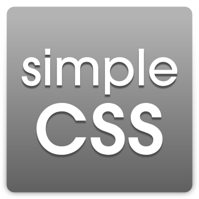

## SimpleCss

Es una libreria (__CSS3__) para el pre-formateo de estilos en paginas webs, que trabaja bajo el patrón de arquitectura de software [CtrlERA](github.com/alqxyz/ctrlERA) , creando un estilo simple en las etiquetas básicas de HTML. [Ejemplo](https://alqxyz.github.io/simpleCss/index.html)
#### Logo


## Instalación
```
<link rel="stylesheet" type="text/css" href="base/E/css/simple/simple.css"/>
<script type="text/javascript" src="base/E/js/simple/simple.js"></script>
```
## E/ (Estructura)
```
├── base/
│   └── E/
│       ├── css/
│       │     └── simple/
│       │            └── simple.css
│       ├── img/
│       │     └── simple/
│       │            ├── raya.png
│       │            └── logo.png
│       ├── js/
│       │    └── simple/
│       │            └── simple.js
│       └── let/
│            └── simple/
│                    └── AvantGarde_LT_Medium.ttf
```

> #### Cuando vayas a programar no pienses en TODO, piensa en TODOS...
###### -Nerio Villalobos